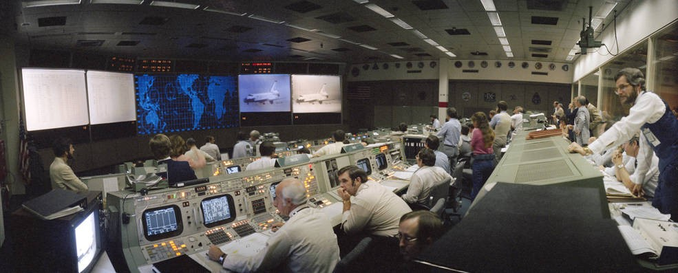
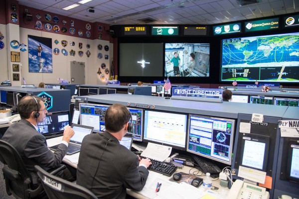
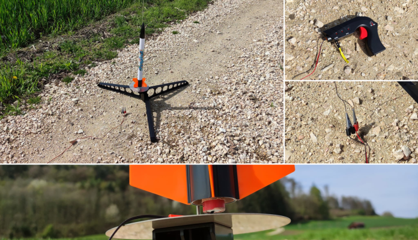

= Raketen-Telemetrie für kleine Forscher

**Berufe aus dem Bereich MINT (Mathematik, Informatik, Naturwissenschaften und Technik) sind gefragt. Arbeitnehmer mit MINT-Fähigkeiten haben selten Probleme, eine gute Anstellung zu finden, einige gründen sogar ihr eigenes Unternehmen. Der Sektor ist eine Zukunftsbranche, hat aber Nachwuchsprobleme. Doch wie lässt sich bei Kindern das Interesse für MINT wecken? Spannende Mitmachprojekte sind der Schlüssel. Gut vorbereitet, kann damit auf den bestehenden Interessen der Kinder aufgebaut werden, wie z.B. mit den Themen Weltraum und Raumfahrt. In diesem Blog-Beitrag stelle ich als Beispiel hierfür einen Workshop vor, in dem wir eine einfache Einsteiger-Modellrakete aus dem Markt verwenden und diese mit Sensor, Funksender und einem Mikrocontroller so erweitern, sodass wir die Höhe der Rakete vom Boden aus live mitverfolgen können.**

Das klingt jetzt womöglich nach einem aufwändigen und schwierigen Vorhaben. Tatsächlich sollten die Inhalte auch ohne spezifisches Vorwissen recht gut zugänglich sein, mit der Ausnahme im Bereich der _Informatik_. Hier werden gewisse Vorkenntnisse vorausgesetzt. Doch genau hierbei kann dieser Workshop eine Stärke ausspielen. Er kann als _Motivator_ dienen, sich _ausdauernd_ diese Grundlagen zu erarbeiten, um schliesslich eine eigene Ground Control für Raketen zu bauen. Weiter unten werde ich auf die benötigten Voraussetzungen im Bereich der Informatik näher eingehen.

Letztendlich kann Ihnen dieser Workshop auch viel Zeit sparen, denn die Inhalte sind praxiserprobt. Sie können sich also darauf verlassen, dass dieses Projekt tatsächlich funktioniert. Und das kann schon viel wert sein! Viele Design-Entscheidung, die sich erst im Praxistest als falsch erwiesen haben, sind hier bereits "ausgemerzt".

== Die technischen Vorbilder
Es kursieren viele verschiedene Namen für eine Ground Control, so z.B. auch "Mission Operations Control". Zur Einstimmung kommt hier ein Foto aus den NASA-Archiven des Jahres 1981 vom damaligen "Mission Operations Control Room", in dem die Landung des _Space Shuttle Columbia_ der historischen _STS-1-Mission_ überwacht wurde:

_Mission Operations Control Room des Space Shuttle (1981), Bildquelle: NASA_

STS-1 war der erste Flug des _Space Shuttles_. Da kamen im Ground Control noch _Röhrenmonitore_, sowie echte Schalter und Knöpfe zum Einsatz. Trotz der grossen und sperrigen Arbeitskonsolen, war die darin befindliche Rechenleistung selbst im Vergleich zu heutigen Smartphones gering.

Wie sah ein Ground Control einige Jahrzehnte später aus? Hier ein Foto des "Mission Control Center" der NASA _Expedition-42_ aus dem Jahr 2014:

_Die Konsole des Flight Directors im Mission Control Center, Bildquelle: NASA_

Genau genommen wird hier von den Mission Operations Engineers der Moment mitverfolgt, in dem sich die _Soyuz_-Kapsel _TMA-14M_ von der _Internationalen Raumstation ISS_ abkoppelt. Mit einem Blick auf die Bildschirme lässt sich erahnen, dass da eine Menge Daten zusammenlaufen.

Unser selbstgebasteltes Ground Control wird aus einem handelsüblichen Laptop und einigen _Arduino_-Komponenten bestehen.

== Der didaktische Zauber und die Zutaten

So viel als Appetizer, kommen wir zum methodischen Hintergrund. Was genau haben wir inhaltlich in diesem Workshop vor und was hat es mit MINT zu tun?

Wir werden in diesem Projekt eine einfache, _handelsübliche Modellrakete_ nehmen und sie technisch aufwerten. Die Rakete hat im gekauften Zustand _keinerlei Sensorik_. So teilt einem die Rakete auch nicht mit, welche _Höhe_ sie überhaupt erreicht hat. Und das ist auch schon eines der Hauptprobleme. Denn wer schon mal eine Modellrakete gestartet hat, weiss, dass die erreichte Höhe der Rakete eine der wichtigsten Informationen ist. Wenn die _erreichte Höhe_ messbar ist, entsteht die grosse Motivation, das Raketendesign immer weiter zu verbessern, um die Flughöhe zu steigern.

Nun gibt es eine weit verbreitete simple Verfahrensweise, um die erreichte Höhe zu bestimmen, nämlich über einen _Sextanten_. Mit Hilfe eines Sextanten wird vom Boden aus per Messung der _Winkeldistanz_ und mit Mitteln der _Triangulation_ die Höhe manuell errechnet. Diese Methodik ist im Hausgebrauch jedoch sehr ungenau, fehleranfällig und auch noch anstrengend. Der ideale Motivator also dies durch den Einsatz von Hightech zu verbessern.

Wir wollen die erreichte Höhe mit MINT-Know-How wesentlich besser messen, nämlich _metergenau_ und _automatisiert_. Wir werden daher die Rakete mit mehreren Komponenten ausstatten, mit

- einem _Sensor für Luftdruck_, sowie
- einer _Funk-Antenne_ im UHF-Bereich (_Ultra High Frequency_), und
- einem _Mikrocontroller_, der die oberen Komponenten informationstechnisch miteinander verbindet.

Für den Mikrocontroller der Rakete werden wir eine _Firmware_ selbst programmieren. Die Rakete wird den Luftdruck messen und den daraus abgeleiteten Wert der Flughöhe per Funk an die Bodenstation senden.

Die Bodenstation wiederum wird ein _handelsüblicher Laptop_ sein. Es sollte ein tragbarer Computer sein, da wir das System mit ins Feld nehmen wollen, dorthin wo die Rakete starten wird. Auch auf dem Laptop werden wir programmieren, und zwar eine Applikation, die die Sensordaten der Rakete empfängt und in einem Diagramm visualisiert (dies ist die Ground-Control-Komponente).

> **Exkurs**: Es ist mir wichtig hervorzuheben, dass wir in diesem Projekt hauptsächlich **offene** Systeme verwenden werden. So benutzen wir als Mikrocontroller einen Arduino. Die Arduino-Plattform wird unter **Open-Hardware-** und **Open-Source-Lizenzen** bereitgestellt. Auch auf dem Laptop programmieren wir mit der quelloffenen Arduino IDE. Dies ist deshalb so wichtig, da **offene Plattformen** besonders wissensdurstige Bastler nicht ausbremsen. Sie geben ihnen die Möglichkeit, jederzeit noch tiefer "unter die Haube" schauen zu können, wenn der Bedarf besteht.

Dieser Workshop hat in allen vier MINT-Bereichen etwas zu bieten. Bei der Umrechnung zwischen physikalischen Grössen kommt _Mathematik_ zum Einsatz. Die _Informatik_ wird zur Programmierung der Telemetrie-Prozesse benötigt. Die _Naturwissenschaften_ helfen, die physikalischen Modelle zu verstehen und in Bezug zu setzen. Beim Bauen der elektronischen Schaltungen kommt auch die _Technik_ nicht zu kurz.

Kommen wir nun zu den Grundlagen und zur Vorbereitung, die es für diesen Workshop braucht.

**Vorkenntnisse**:

- _Grundlegende Programmierung_ in C++
- _Grundverständnis der Physik_ rund um _elektrische Ströme_ und _elektromagnetische Wellen_ (Optik)
- Einfaches Löten (optional)

Die Fähigkeiten in der Programmierung müssen für diesen Workshop nicht sehr ausgeprägt sein. Es reichen schon einige Grundlagen im Programmieren in der Sprache C++. Die Programmier-Themen _Datentypen_, _Kontrollstrukturen_ (Verzweigungen, Schleifen etc.) und _Objekt-Orientierung_ sollten zumindest grundlegend bekannt sein und praktisch angewendet werden können.

**Einkaufsliste für das Projekt**:

Kommen wir nun aber zu den Hardware-Zutaten, die wir für dieses Projekt benötigen. Und dies wäre die Einkaufsliste:

- 2x Arduino MKR WAN 1310 (Stückpreis 40 CHF)
- 1x Mini-Powerbank BioLite Charge 10 (15 CHF)
- 3x USB-Kabel (2x zum Anschliessen der Arduinos, 1x zum Aufladen der Powerbank)
- 2x Arduino Dipole Pentaband Waterproof Antenna (5 CHF)
1x Luftdruck-Sensor Adafruit BMP388 (10 CHF)
- 1x Pegasus Modellrakete Starter Set der Klima GmbH (70 CHF)
- 1x Set Modellraketen-Motoren C6-5 (6 Stück für 23 CHF)
- 1x Lötkolben und Lötzinn, oder alternativ:
- 1x 0.2 ml Enson Silver Conductive Wire Glue (elektrisch leitfähiger Klebstoff)
- Klebeband
- 1x Laptop

Ich gebe hier keine Links auf die Produkte an, da die Links schnell defekt sind. Eine Suchmaschine führt mit den oben angegebenen Bezeichnungen jedoch schnell zum Ziel.

Bezüglich des Laptops gilt: Es muss kein Neugerät sein, ganz im Gegenteil, die Performance-Anforderungen sind verhältnismässig gering. Es sollte jedoch ein Laptop sein, kein Desktop-PC, da wir die Ground Control mit ins Feld nehmen werden. Die Beispiele in diesem Workshop sind unter _Windows 10_ ausgeführt worden, jedoch habe ich darauf geachtet, durchgehend System-übergreifende Software-Komponenten zu verwenden, sodass alle Beispiele genauso auch unter _Linux_ oder auf einem _Mac_ funktionieren sollten.

In der Liste besonders hervorzuheben ist sicherlich die Rakete selbst, in diesem Fall die _Klima Pegasus_, die auf der Startrampe eine gute Figur macht:

_Impressionen Pegasus-Set_

Der Vorteil bei der Verwendung der ausgewählten Komponenten ist, dass die Abmessungen gut aufeinander abgestimmt sind. So passen der Arduino MKR WAN 1310, inkl. BioLite-Akku, Pentaband-Antenne und Luftdruck-Sensor BMP388 alle zusammen in den "Frachtraum" der Pegasus-Rakete.

Sie sollten für diesen Workshop evtl. etwas mehr budgetieren, als oben aufgelistet ist, denn es sollte nicht verschwiegen werden, dass bei einem Raketenprojekt Dinge auch mal kaputt gehen können. Falls dann tatsächlich an Ihren Raketenbauteilen sich mal etwas in Rauch auflöst, denken Sie immer an ein Zitat des antiken Philosophen und Stoikers _Epiktet_:

> Der Weg zum Glück besteht darin, sich um nichts zu sorgen, was sich unserem Einfluss entzieht.

**Voraussetzungen bei der Software**:

- Windows, Linux oder MacOS als Betriebssystem
- Arduino IDE 2 (integrierte Entwicklungsumgebung für Arduino-Hardware)

Dies sind die Software-Komponenten, die wir zur Entwicklung der Ground Control und der Sensor-Systeme benötigen. Für diesen Workshop sollte die _Arduino IDE_ auf dem Laptop/Computer installiert sein. Auch hier werde ich keinen Downloadlink angeben, da diese oft schnell "veralten". Mit Ihrer präferierten Suchmaschine sollte sich die Download-Seite aber schnell finden lassen.

Wir benötigen die Arduino IDE als Entwicklungsumgebung für die Arduino-Plattform. Die Arduino IDE wird uns dabei unterstützen, Programmier-Code in einer stark an C++ angelehnten Sprache für die Arduino-Mikrocontroller zu schreiben und den kompilierten Code auf den Mikrocontroller zu übertragen.

Es geht in der Arduino IDE ans "eingemachte", und wir programmieren _Firmware_ direkt für die Hardware. Die Firmware-Programmierung ist ein spezieller Bereich der Software-Entwicklung, in dem es darum geht, systemnah Funktionalität der Hardware als Treiber bereitzustellen. Also genau das, was wir für das Auslesen unserer Raketen-Sensoren benötigen.

**Die Nutzlast der Rakete**

Die _Payload Capacity_ (_Nutzlast_) der Rakete gibt an, welches Gewicht auf eine Rakete maximal zugeladen werden darf. Bei _SpaceX's Starship_, der bisher grössten gebauten Rakete, wird dieses z.B. mit _150 Tonnen_ angegeben.

Wir ersparen uns an dieser Stelle die Berechnung der max. Nutzlast bei unserer Rakete, die zulässig ist, damit diese überhaupt abheben kann. Das Praxisexperiment wird schon zeigen, ob wir die Nutzlast mit unserer Zuladung überschreiten. Wir prüfen aber vorgängig, ob die geplante Zuladung für die Sensorik von den Abmessungen her überhaupt passt und protokollieren zumindest, welches Zusatzgewicht diese erzeugt.

Der Frachtraum der Pegasus-Rakete hat einen Umfang von _35 mm_. Folgende Umfänge haben die Komponenten, die mitfliegen sollen:

- Arduino MKR: _25 mm_
- BMP388: _18 mm_
- BioLite-Akku: _21 mm_
- Pentaband-Antenne: _16 mm_

Demnach passen alle Komponenten in den Frachtraum.

Mit welchem Zusatzgewicht haben wir durch die Zuladung zu rechnen? Hierzu habe ich alle Komponenten gewogen, die in den Frachtraum kommen sollen. Dies ist das Ergebnis: